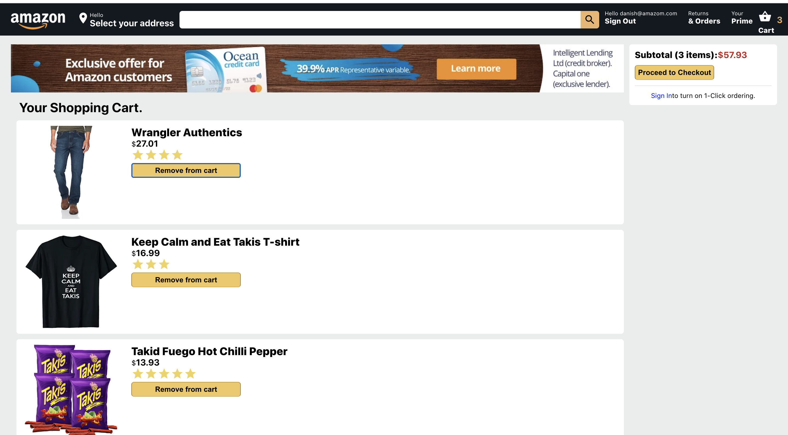

# amazon-app
Created a single page amazon-clone-app using ReactJS, React Context Api, CSS3, and Firebase authentication.

## app live demo link
https://app-b8fce.web.app/

## run instruction

```
- download zip or clone repo on your local machine
- cd amazon-app
- npm i
- npm start
```

##
## Sign In Page:


## Home Page:


## Checkout Page:


## app functionaliy
Basic features such as sign in and out, add items to cart and delete items from cart.
Primary purose was to make a good Amazon type UI with very minimum functionality.

## author 
Danish Siddiqui


